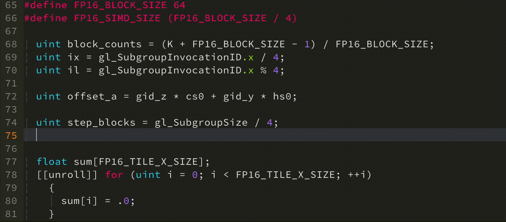
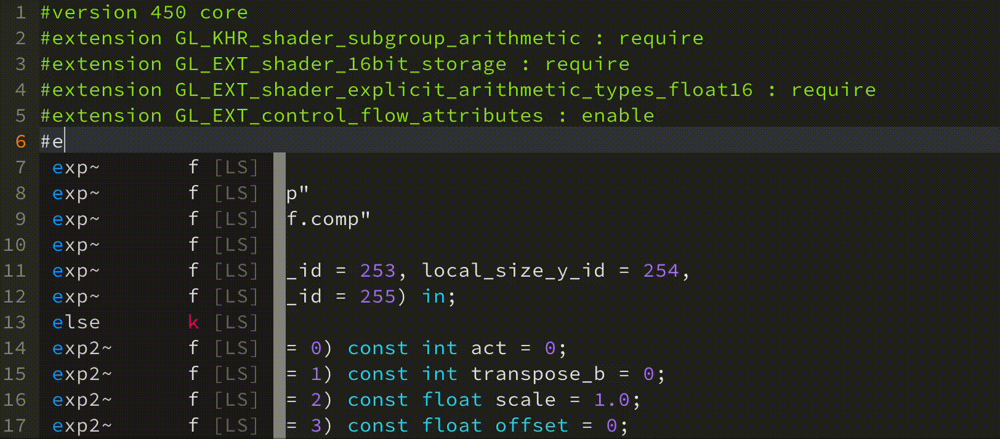
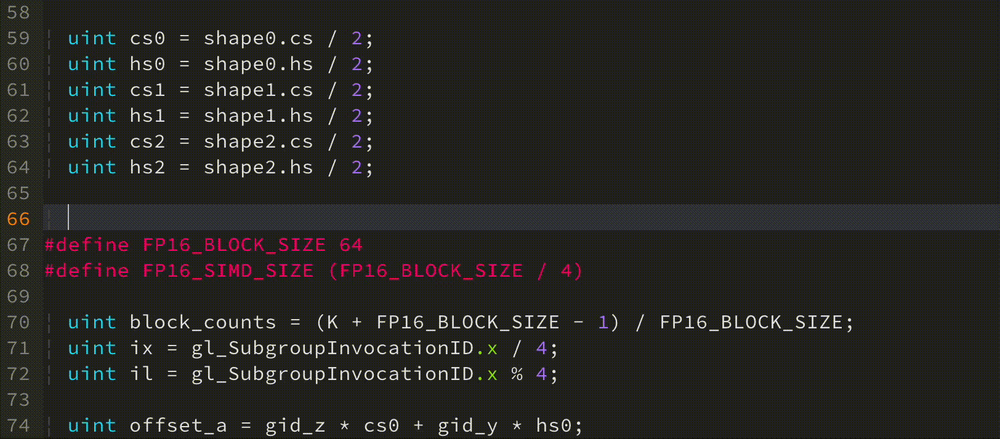
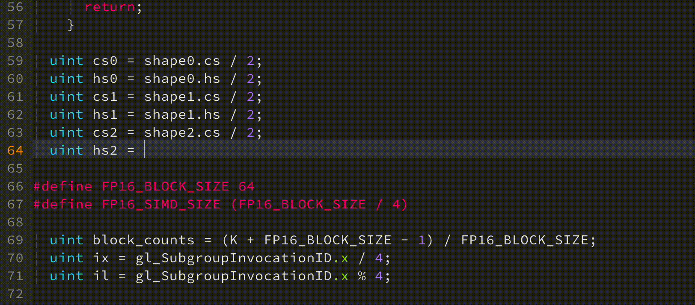
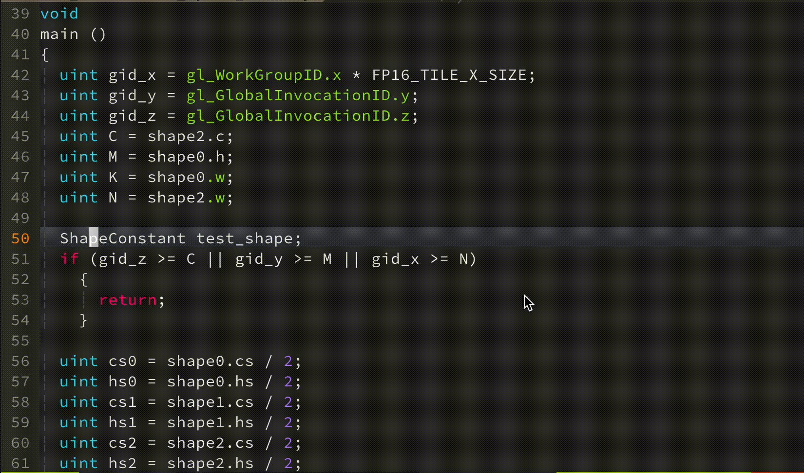
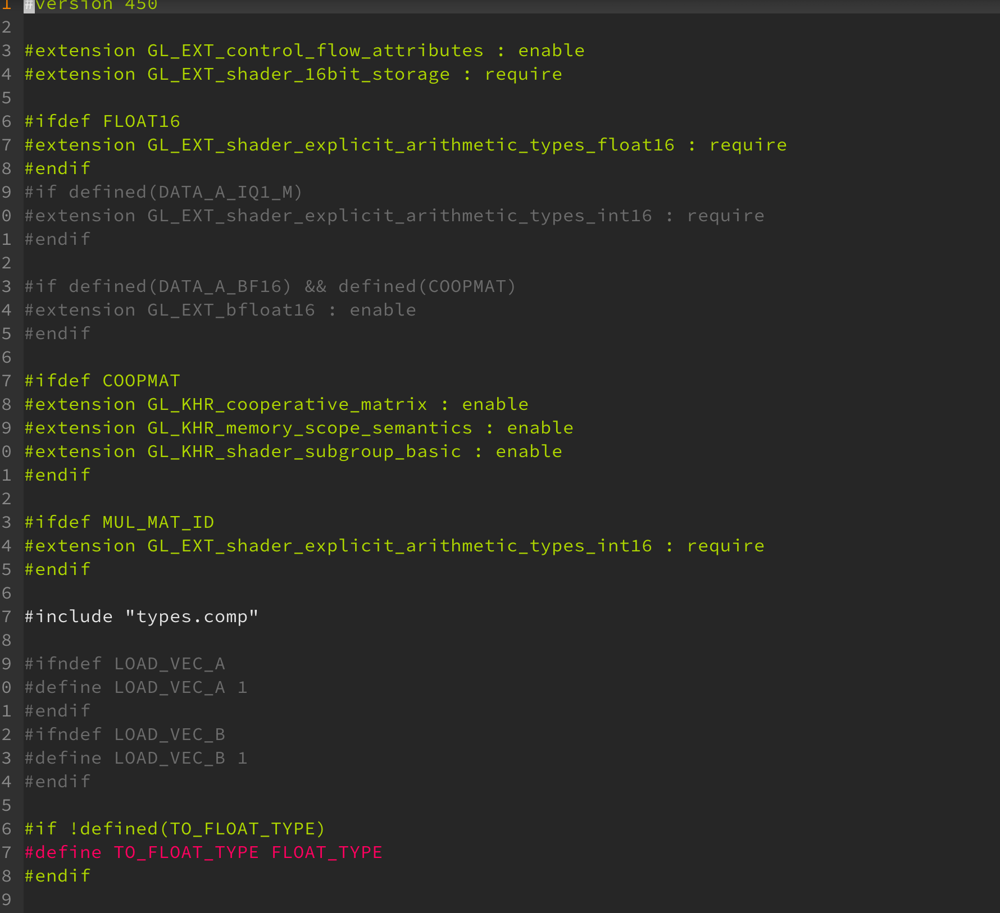

# glslx: GLSL Language Server ✨

[](LICENSE)
[](https://isocpp.org/)
[](https://cmake.org/)
[](https://github.com/ComingToy/glslx/actions)

glslx 是一个基于 [Khronos Group glslang](https://github.com/KhronosGroup/glslang) 官方编译库实现的高性能GLSL语言服务器，为GLSL着色器开发提供全面且准确的语言支持。🚀

## ✨ 功能特性

### ✅ 已实现功能
- **智能代码补全**
  - 用户定义变量、结构体和函数
  - 内置变量、函数和数据类型
  - 语言关键字和扩展指令
  - 结构体成员自动补全
- **精确的代码导航**
  - 跳转到定义 (Go to Definition)
  - 文档大纲视图 (Outline)
- **实时错误诊断**
  - 基于glslang的语法和语义检查
- **头文件支持**
  - 完整处理`#include`指令
- **条件编译支持**
  - 根据条件编译结果标记inactive分支

### 🚧 规划中的特性
- 语义标记 (Semantic Tokens)
- 悬停文档 (Hover Documentation)
- 引用查找 (Find References)

## 🔧 构建指南

### 系统要求
- CMake 3.26+
- C++17兼容编译器

### 构建步骤
1. 克隆仓库（包含子模块）：
   ```bash
   git clone --recursive https://github.com/ComingToy/glslx.git
   cd glslx
   ```

2. 配置并构建项目：
   ```bash
   cmake -DENABLE_OPT=OFF -B build -S .
   cmake --build build --parallel
   ```

3. 安装（可选）：
   ```bash
   sudo cp build/src/glslx /usr/local/bin/
   ```

## 📖 使用说明

### Neovim (coc.nvim) 配置示例

1. 编辑coc.nvim配置文件 `~/.config/nvim/coc-settings.json`：
   ```json
   {
     "languageserver": {
       "glslang": {
         "command": "/usr/local/bin/glslx",
         "filetypes": ["glslx"],
       }
     }
   }
   ```

2. 编译指令配置：
   在项目根目录创建 `compile_commands_glslx.json` 文件，格式遵循[编译数据库规范](https://clang.llvm.org/docs/JSONCompilationDatabase.html)。示例：
   ```json
   [
     {
       "directory": "/path/to/project",
       "command": "glslc --target-env=vulkan1.3 -DInputType=float16_t -o output.spv -I /path/to/includes source.comp",
       "file": "/path/to/project/source.comp",
       "output": "output.spv"
     }
   ]
   ```

## 🎥 功能演示

| 功能 | 演示 |
|------|------|
| 代码诊断 |  |
| 扩展补全 |  |
| 函数补全 |  |
| 结构体成员补全 |  |
| 跳转到定义 |  |  
| 条件编译支持 | 

## 📜 许可证

本项目采用MIT许可证。详情见[LICENSE](./LICENSE)文件。
